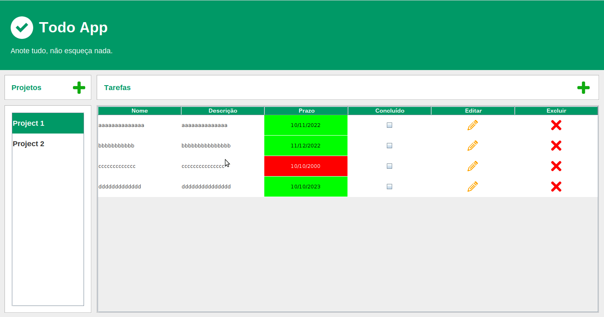

# About the project / *Sobre o projeto*

This is a Java Full Stack project developed for Capgemini's Start Program, where the objective is to build a task control application (Todo App). The app allows adding projects and related tasks with deadline indicator and task completion. The project included clean code development with object-oriented programming (OOP) and SOLID principles.

---

*Esse é um projeto em Java Full Stack desenvolvido para o Programa Start da Capgemini, onde o objetivo é construir uma aplicação de controle de tarefas (Todo App). O app permite adição de projetos e tarefas relacionadas com indicador de prazo e conclusão da tarefa. O projeto contemplou desenvolvimento em código limpo com programação orientada a objetos (POO) e princípios SOLID.*

---
# Skills / *Habilidades*

  - Full Stack development / *Desenvolvimento Full Stack*
  - Java
  - MySQL
  - Clean Code / *Código Limpo*
  - Object-Oriented Programming / *Programação Orientada a Objetos*
  - SOLID principles / *Princípios SOLID*

---
# Layout

---
# Deployment / *Implantação*

- dump sql from database.sql
- run view > MainScreen

